# 🏗️ Architecture Guide

[](https://reactjs.org/)
[](https://nodejs.org/)
[](https://www.mysql.com/)

Comprehensive guide to the system architecture, design patterns, data flow, and technical decisions for the Portfolio Web Application.

## 📋 Table of Contents

- [System Overview](#system-overview)
- [Architecture Patterns](#architecture-patterns)
- [Frontend Architecture](#frontend-architecture)
- [Backend Architecture](#backend-architecture)
- [Database Design](#database-design)
- [Security Architecture](#security-architecture)
- [Data Flow](#data-flow)
- [Design Patterns](#design-patterns)
- [Performance Considerations](#performance-considerations)
- [Scalability](#scalability)
- [Deployment Architecture](#deployment-architecture)
- [Monitoring & Logging](#monitoring--logging)

## System Overview

### High-Level Architecture

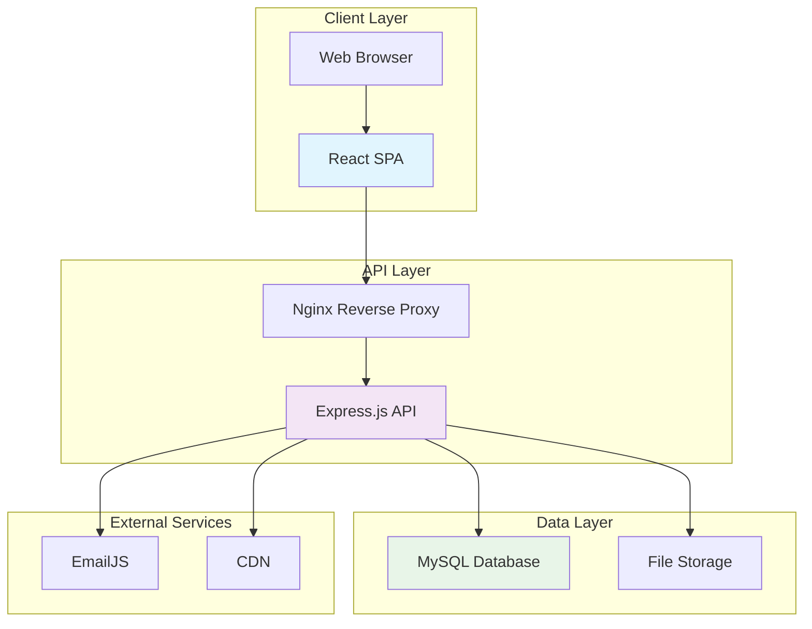

### Technology Stack

| Layer | Technology | Purpose |
|-------|------------|---------|
| **Frontend** | React 18 + TypeScript | User interface and interactions |
| **Build Tool** | Vite | Fast development and optimized builds |
| **Styling** | Tailwind CSS | Utility-first CSS framework |
| **State Management** | React Context | Global state management |
| **Routing** | React Router | Client-side routing |
| **Backend** | Node.js + Express.js | REST API server |
| **Language** | TypeScript | Type-safe development |
| **Database** | MySQL | Relational data storage |
| **ORM** | Prisma | Database access and migrations |
| **Authentication** | JWT | Secure user authentication |
| **File Storage** | Local File System | Static file serving |
| **Email** | EmailJS | Contact form handling |

## Architecture Patterns

### Frontend Patterns

#### Component Architecture

```
src/components/
├── layout/          # Layout components (MainLayout, Header)
├── sections/        # Page sections (Hero, About, Projects)
├── ui/              # Reusable UI components (Button, Input)
├── admin/           # Admin-specific components
└── shared/          # Shared components
```

#### Custom Hooks Pattern

```typescript
// useProjects.ts - Data fetching hook
export const useProjects = () => {
  const [projects, setProjects] = useState<Project[]>([]);
  const [loading, setLoading] = useState(true);

  useEffect(() => {
    fetchProjects();
  }, []);

  const fetchProjects = async () => {
    try {
      const response = await api.get('/projects');
      setProjects(response.data);
    } catch (error) {
      console.error('Failed to fetch projects:', error);
    } finally {
      setLoading(false);
    }
  };

  return { projects, loading, refetch: fetchProjects };
};
```

#### Context Pattern

```typescript
// ThemeContext.tsx
interface ThemeContextType {
  theme: 'light' | 'dark';
  toggleTheme: () => void;
}

export const ThemeProvider: React.FC<{ children: React.ReactNode }> = ({ children }) => {
  const [theme, setTheme] = useState<'light' | 'dark'>(() => {
    return localStorage.getItem('theme') as 'light' | 'dark' || 'light';
  });

  const toggleTheme = () => {
    const newTheme = theme === 'light' ? 'dark' : 'light';
    setTheme(newTheme);
    localStorage.setItem('theme', newTheme);
  };

  return (
    <ThemeContext.Provider value={{ theme, toggleTheme }}>
      {children}
    </ThemeContext.Provider>
  );
};
```

### Backend Patterns

#### MVC Pattern

```
src/
├── controllers/     # Request handlers (auth.controller.ts)
├── routes/          # Route definitions (auth.routes.ts)
├── services/        # Business logic (auth.service.ts)
├── middleware/      # Express middleware (auth.middleware.ts)
├── types/           # TypeScript definitions
└── utils/           # Utility functions
```

#### Service Layer Pattern

```typescript
// auth.service.ts
export class AuthService {
  async validateCredentials(username: string, password: string): Promise<Admin | null> {
    const admin = await prisma.admin.findUnique({
      where: { username }
    });

    if (!admin) return null;

    const isValidPassword = await bcrypt.compare(password, admin.passwordHash);
    return isValidPassword ? admin : null;
  }

  async generateToken(admin: Admin): Promise<string> {
    return jwt.sign(
      { id: admin.id, username: admin.username },
      process.env.JWT_SECRET!,
      { expiresIn: '7d' }
    );
  }
}
```

#### Repository Pattern

```typescript
// project.repository.ts
export class ProjectRepository {
  async findAll(options: FindOptions = {}): Promise<Project[]> {
    return prisma.project.findMany({
      where: options.where,
      orderBy: options.orderBy,
      skip: options.skip,
      take: options.take,
      include: {
        creator: true
      }
    });
  }

  async findById(id: number): Promise<Project | null> {
    return prisma.project.findUnique({
      where: { id },
      include: {
        creator: true
      }
    });
  }

  async create(data: CreateProjectData): Promise<Project> {
    return prisma.project.create({
      data,
      include: {
        creator: true
      }
    });
  }
}
```

## Frontend Architecture

### Component Hierarchy

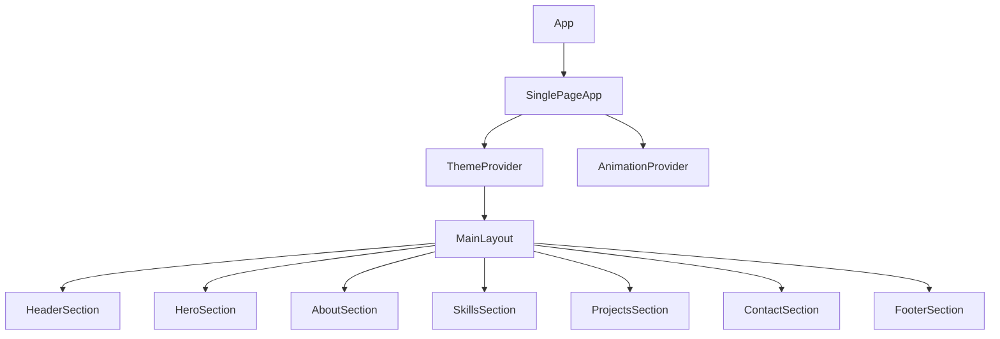

### State Management

#### Local State (useState)

```typescript
const [formData, setFormData] = useState<ContactFormData>({
  name: '',
  email: '',
  message: ''
});
```

#### Global State (Context)

```typescript
// For theme management
const { theme, toggleTheme } = useContext(ThemeContext);

// For animation preferences
const { animationsEnabled, toggleAnimations } = useContext(AnimationContext);
```

#### Server State (Custom Hooks)

```typescript
const { projects, loading, error, refetch } = useProjects();
const { sendMessage, isSubmitting } = useContactForm();
```

### Routing Architecture

```typescript
// App.tsx
function App() {
  return (
    <BrowserRouter>
      <Routes>
        <Route path="/" element={<SinglePageApp />} />
        <Route path="/admin/login" element={<AdminLogin />} />
        <Route path="/admin/dashboard" element={
          <ProtectedRoute>
            <AdminDashboard />
          </ProtectedRoute>
        } />
      </Routes>
    </BrowserRouter>
  );
}
```

## Backend Architecture

### Layered Architecture

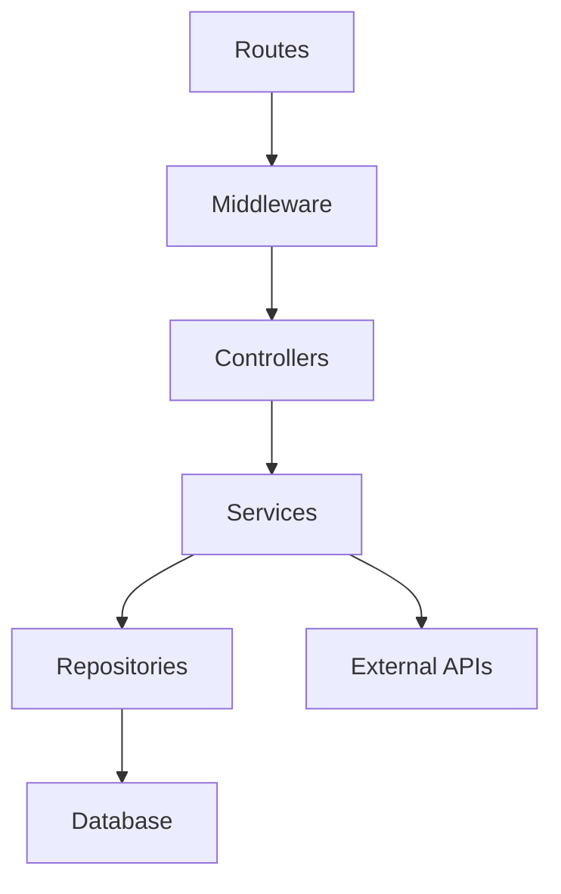

### Request Flow

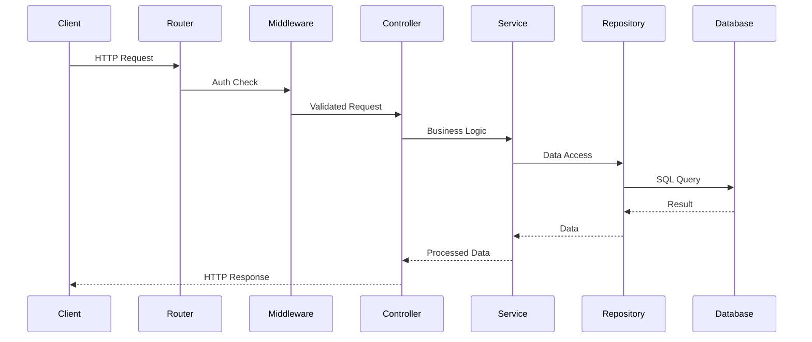

### Error Handling

```typescript
// Global error handler
app.use((error: Error, req: Express.Request, res: Express.Response, next: Express.NextFunction) => {
  console.error(error);

  if (error instanceof ValidationError) {
    return res.status(400).json({
      success: false,
      error: {
        code: 'VALIDATION_ERROR',
        message: error.message,
        details: error.details
      }
    });
  }

  if (error instanceof AuthenticationError) {
    return res.status(401).json({
      success: false,
      error: {
        code: 'UNAUTHORIZED',
        message: 'Authentication required'
      }
    });
  }

  res.status(500).json({
    success: false,
    error: {
      code: 'INTERNAL_ERROR',
      message: 'Internal server error'
    }
  });
});
```

## Database Design

### Schema Design

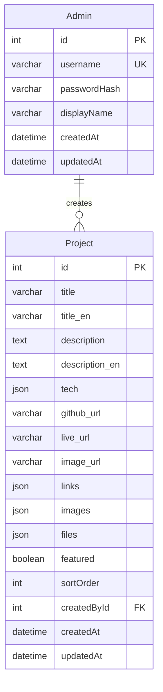

### Indexing Strategy

```sql
-- Primary keys (auto-indexed)
-- Foreign keys (auto-indexed)

-- Additional indexes for performance
CREATE INDEX idx_project_featured ON Project(featured);
CREATE INDEX idx_project_sort_order ON Project(sortOrder);
CREATE INDEX idx_project_created_at ON Project(createdAt DESC);
CREATE INDEX idx_admin_username ON Admin(username);
```

### Data Relationships

- **One-to-Many**: Admin → Projects (one admin can create many projects)
- **Optional Foreign Key**: Projects.creator (projects can exist without creator)

## Security Architecture

### Authentication Flow

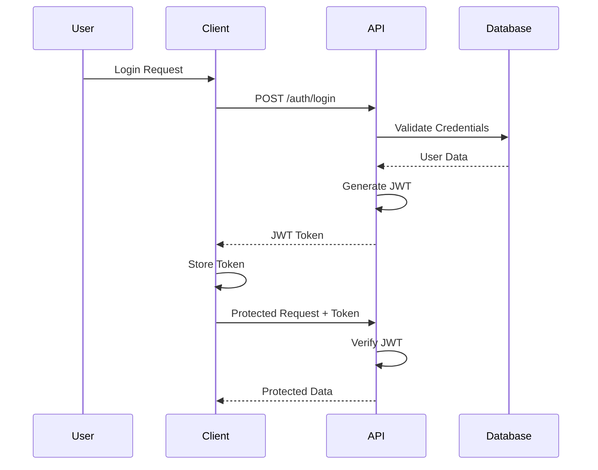

### Security Layers

#### 1. Network Security
- HTTPS enforcement
- CORS configuration
- Rate limiting (100 req/hour for unauth, 1000 req/hour for auth)

#### 2. Application Security
- Input validation (Zod schemas)
- SQL injection prevention (Prisma ORM)
- XSS protection (Helmet.js)
- CSRF protection (if needed)

#### 3. Data Security
- Password hashing (bcrypt, 12 rounds)
- JWT token encryption
- Sensitive data encryption
- File upload validation

### Password Security

```typescript
// Password hashing
const saltRounds = 12;
const hashedPassword = await bcrypt.hash(password, saltRounds);

// Password verification
const isValid = await bcrypt.compare(password, hashedPassword);
```

### JWT Security

```typescript
// Token generation
const token = jwt.sign(
  {
    id: admin.id,
    username: admin.username,
    type: 'admin'
  },
  process.env.JWT_SECRET!,
  {
    expiresIn: '7d',
    issuer: 'portfolio-api',
    audience: 'portfolio-client'
  }
);
```

## Data Flow

### Project Creation Flow

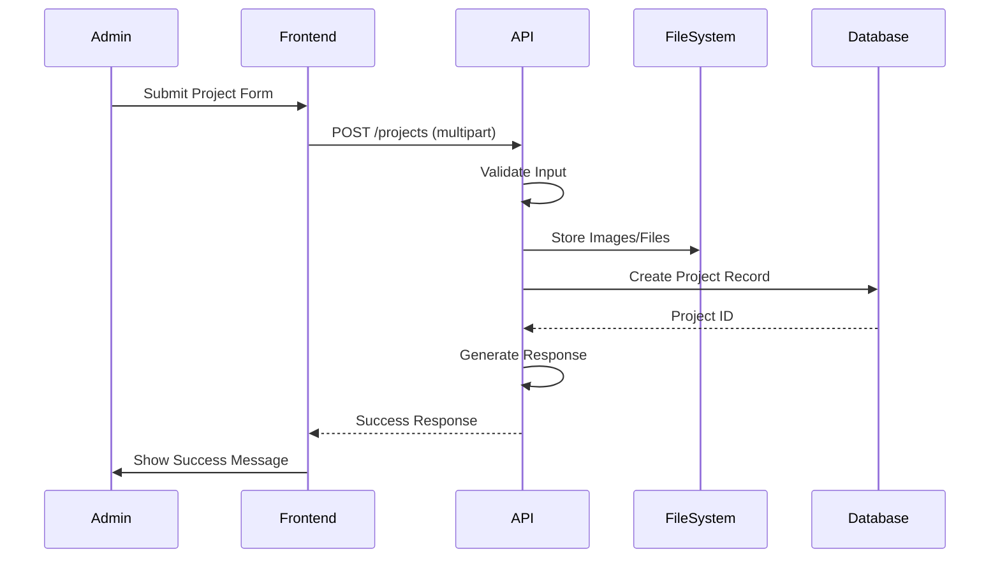

### Contact Form Flow

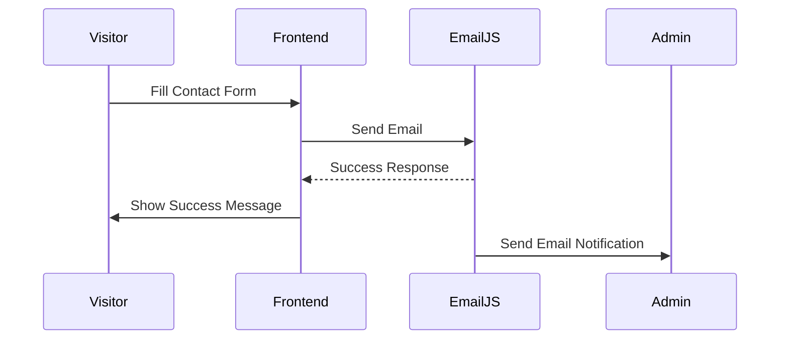

## Design Patterns

### Singleton Pattern

```typescript
// Database connection
class Database {
  private static instance: Database;
  private prisma: PrismaClient;

  private constructor() {
    this.prisma = new PrismaClient();
  }

  static getInstance(): Database {
    if (!Database.instance) {
      Database.instance = new Database();
    }
    return Database.instance;
  }
}
```

### Factory Pattern

```typescript
// Service factory
class ServiceFactory {
  static createAuthService(): AuthService {
    return new AuthService();
  }

  static createProjectService(): ProjectService {
    return new ProjectService();
  }
}
```

### Strategy Pattern

```typescript
// File upload strategies
interface UploadStrategy {
  upload(file: Express.Multer.File): Promise<string>;
}

class LocalUploadStrategy implements UploadStrategy {
  async upload(file: Express.Multer.File): Promise<string> {
    // Local file system upload
  }
}

class CloudUploadStrategy implements UploadStrategy {
  async upload(file: Express.Multer.File): Promise<string> {
    // Cloud storage upload
  }
}
```

### Observer Pattern

```typescript
// Event system
class EventEmitter {
  private events: Map<string, Function[]> = new Map();

  on(event: string, callback: Function) {
    if (!this.events.has(event)) {
      this.events.set(event, []);
    }
    this.events.get(event)!.push(callback);
  }

  emit(event: string, data: any) {
    const callbacks = this.events.get(event);
    if (callbacks) {
      callbacks.forEach(callback => callback(data));
    }
  }
}
```

## Performance Considerations

### Frontend Performance

#### Code Splitting

```typescript
// Lazy loading components
const AdminDashboard = lazy(() => import('./pages/AdminDashboard'));

// Route-based code splitting
const routes = [
  {
    path: '/admin',
    element: (
      <Suspense fallback={<LoadingSpinner />}>
        <AdminRoutes />
      </Suspense>
    )
  }
];
```

#### Image Optimization

```typescript
// Responsive images

```

#### Bundle Analysis

```bash
# Analyze bundle size
npm run build
npx vite-bundle-analyzer dist
```

### Backend Performance

#### Database Optimization

```sql
-- Query optimization
EXPLAIN SELECT * FROM projects WHERE featured = 1 ORDER BY sortOrder;

-- Connection pooling
const prisma = new PrismaClient({
  datasources: {
    db: {
      url: process.env.DATABASE_URL
    }
  }
});
```

#### Caching Strategy

```typescript
// In-memory cache for frequently accessed data
const cache = new Map<string, any>();

const getCachedProjects = async () => {
  const cacheKey = 'featured-projects';
  const cached = cache.get(cacheKey);

  if (cached && Date.now() - cached.timestamp < 300000) { // 5 minutes
    return cached.data;
  }

  const projects = await projectService.getFeatured();
  cache.set(cacheKey, { data: projects, timestamp: Date.now() });
  return projects;
};
```

## Scalability

### Horizontal Scaling

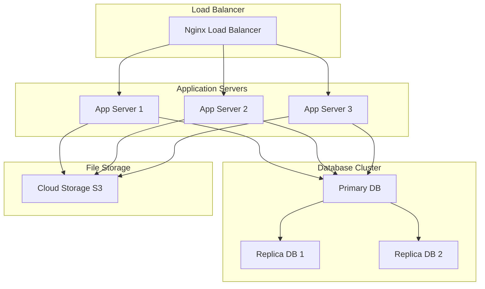

### Database Scaling

- **Read Replicas**: Distribute read operations
- **Sharding**: Split data across multiple databases
- **Caching Layer**: Redis for session and data caching

### CDN Integration

```typescript
// CDN configuration for static assets
const cdnUrl = process.env.CDN_URL || '';

const getAssetUrl = (path: string) => {
  return cdnUrl ? `${cdnUrl}${path}` : path;
};
```

## Deployment Architecture

### Development Environment

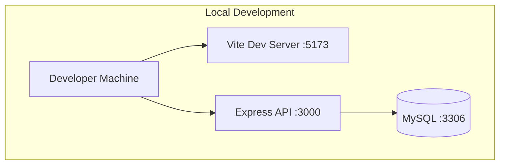

### Production Environment

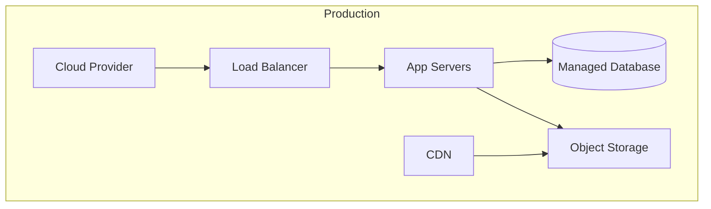

### Docker Configuration

```dockerfile
# Multi-stage Dockerfile
FROM node:18-alpine AS builder

WORKDIR /app
COPY package*.json ./
RUN npm ci --only=production

FROM node:18-alpine AS runner

WORKDIR /app
COPY --from=builder /app/node_modules ./node_modules
COPY . .

EXPOSE 3000
CMD ["npm", "start"]
```

## Monitoring & Logging

### Application Logging

```typescript
// Structured logging
import winston from 'winston';

const logger = winston.createLogger({
  level: 'info',
  format: winston.format.combine(
    winston.format.timestamp(),
    winston.format.errors({ stack: true }),
    winston.format.json()
  ),
  transports: [
    new winston.transports.File({ filename: 'error.log', level: 'error' }),
    new winston.transports.File({ filename: 'combined.log' })
  ]
});

// Usage
logger.info('User logged in', { userId: 123, ip: '192.168.1.1' });
logger.error('Database connection failed', { error: err.message });
```

### Performance Monitoring

```typescript
// Response time middleware
app.use((req, res, next) => {
  const start = Date.now();
  res.on('finish', () => {
    const duration = Date.now() - start;
    logger.info('Request completed', {
      method: req.method,
      url: req.url,
      statusCode: res.statusCode,
      duration: `${duration}ms`,
      userAgent: req.get('User-Agent')
    });
  });
  next();
});
```

### Health Checks

```typescript
// Health check endpoint
app.get('/health', async (req, res) => {
  try {
    // Check database connection
    await prisma.$queryRaw`SELECT 1`;

    // Check file system access
    await fs.access(process.env.UPLOAD_DIR!);

    res.json({
      status: 'healthy',
      timestamp: new Date().toISOString(),
      services: {
        database: 'up',
        filesystem: 'up'
      }
    });
  } catch (error) {
    res.status(503).json({
      status: 'unhealthy',
      timestamp: new Date().toISOString(),
      error: error.message
    });
  }
});
```

### Error Tracking

```typescript
// Global error handler with Sentry
import * as Sentry from '@sentry/node';

Sentry.init({
  dsn: process.env.SENTRY_DSN,
  environment: process.env.NODE_ENV
});

app.use(Sentry.Handlers.errorHandler());
```

---

This architecture guide provides a comprehensive overview of the system's design and technical decisions. For implementation details, refer to the specific component documentation and API reference.
